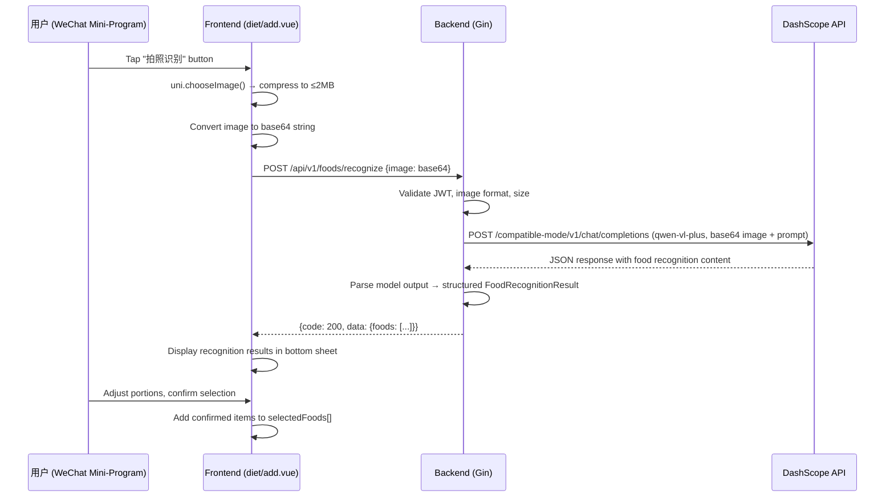
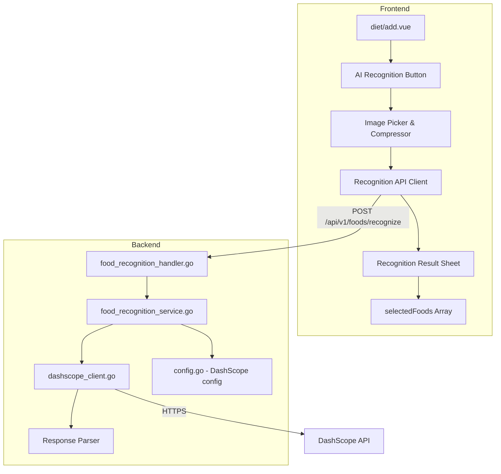

# Design Document: AI Food Recognition

## Overview

This feature adds AI-powered food recognition to the existing diet tracking flow. Users can take a photo or select an image from their album on the `diet/add.vue` page. The image is compressed on the client, uploaded to the backend, which then calls the Alibaba DashScope API (qwen-vl series model) to identify foods and estimate nutrition data. Results are displayed in a confirmation sheet where users can adjust portions before adding items to their diet record.

The design integrates into the existing Go + Gin backend and Vue 3 + uni-app frontend without altering existing data models or API contracts. A new `POST /api/v1/foods/recognize` endpoint is added behind JWT auth, and a new `FoodRecognitionService` handles the DashScope interaction.

### Key Design Decisions

1. **Model choice**: `qwen-vl-plus` (Qwen2.5-VL series) — good balance of speed, cost, and accuracy for food recognition. Configurable in `config.yaml` so it can be upgraded to `qwen3-vl-flash` or `qwen3-vl-plus` later.
2. **Image transfer**: Base64 encoding in the request body (not multipart form). The frontend compresses to ≤2MB, the backend enforces a 5MB hard limit. Base64 is used because the DashScope API accepts base64 data URLs directly, avoiding the need for intermediate object storage.
3. **Prompt engineering**: A structured system prompt instructs the model to return JSON with food names (Chinese), estimated grams, and per-100g nutrition values. This keeps parsing deterministic.
4. **No new database tables**: Recognition results are transient — they flow from API response to the frontend's `selectedFoods` array and are persisted only when the user saves the diet record via the existing `POST /api/v1/diets/` endpoint.

## Architecture



### Component Architecture



## Components and Interfaces

### Backend Components

#### 1. Config Extension (`internal/config/config.go`)

Add DashScope configuration to the existing `Config` struct:

```go
// DashScope AI 模型配置
type DashScope struct {
    APIKey   string `mapstructure:"API_KEY"`
    Model    string `mapstructure:"MODEL"`
    BaseURL  string `mapstructure:"BASE_URL"`
    Timeout  int    `mapstructure:"TIMEOUT"` // seconds, default 15
}
```

Config YAML addition:
```yaml
DASHSCOPE:
  API_KEY: "sk-xxx"
  MODEL: "qwen-vl-plus"
  BASE_URL: "https://dashscope.aliyuncs.com/compatible-mode/v1"
  TIMEOUT: 15
```

Environment variable overrides: `DASHSCOPE_API_KEY`, `DASHSCOPE_MODEL`, `DASHSCOPE_BASE_URL`, `DASHSCOPE_TIMEOUT`.

#### 2. DashScope Client (`internal/service/dashscope_client.go`)

Responsible for constructing and sending requests to the DashScope OpenAI-compatible API.

```go
type DashScopeClient struct {
    apiKey     string
    model      string
    baseURL    string
    httpClient *http.Client
}

// RecognizeFood sends an image to the DashScope API and returns the raw model response text.
func (c *DashScopeClient) RecognizeFood(ctx context.Context, imageBase64 string, mimeType string) (string, error)
```

The client constructs an OpenAI-compatible chat completion request:
- `model`: from config (default `qwen-vl-plus`)
- `messages`: system prompt + user message with base64 image
- `temperature`: 0.1 (low for deterministic structured output)
- `max_tokens`: 2048

#### 3. Food Recognition Service (`internal/service/food_recognition_service.go`)

Orchestrates the recognition flow: validates input, calls DashScope client, parses response.

```go
type FoodRecognitionService struct {
    client *DashScopeClient
}

func NewFoodRecognitionService(cfg config.DashScope) *FoodRecognitionService

// RecognizeFood validates the image and returns structured recognition results.
func (s *FoodRecognitionService) RecognizeFood(ctx context.Context, imageBase64 string, mimeType string) (*FoodRecognitionResponse, error)

// parseModelResponse extracts structured food data from the model's text output.
func (s *FoodRecognitionService) parseModelResponse(raw string) ([]RecognizedFood, error)
```

#### 4. Food Recognition Handler (`internal/handler/food_recognition_handler.go`)

HTTP handler following the existing pattern in `diet_handler.go`.

```go
type FoodRecognitionHandler struct {
    service *service.FoodRecognitionService
}

func NewFoodRecognitionHandler(cfg config.DashScope) *FoodRecognitionHandler

// RecognizeFood handles POST /api/v1/foods/recognize
func (h *FoodRecognitionHandler) RecognizeFood(c *gin.Context)
```

#### 5. Prompt Design

System prompt sent to the model:

```
你是一个专业的食物营养分析助手。请分析图片中的食物，返回JSON格式的识别结果。

要求：
1. 识别图片中所有可见的食物
2. 为每种食物估算合理的份量（克数）
3. 提供每100g的营养数据（热量、蛋白质、碳水化合物、脂肪）
4. 食物名称使用中文
5. 如果无法识别图片中的食物，返回空数组

请严格按照以下JSON格式返回，不要包含任何其他文字：
{
  "foods": [
    {
      "name": "食物名称",
      "estimated_grams": 150,
      "calories_per_100g": 116,
      "protein_per_100g": 20.5,
      "carbs_per_100g": 0,
      "fat_per_100g": 3.8,
      "confidence": 0.9
    }
  ]
}

confidence 取值 0-1，表示识别置信度。低于 0.6 视为低置信度。
```

### Frontend Components

#### 1. API Client Extension (`src/api/diet.js`)

```javascript
// Upload image for AI food recognition
export const recognizeFood = (imageBase64) => post('/foods/recognize', { image: imageBase64 })
```

Note: The existing `request.js` utility handles JWT token injection and error responses, so `recognizeFood` uses the same `post` helper.

#### 2. AI Recognition UI (integrated into `diet/add.vue`)

New UI elements added to the existing page:

- **AI Recognition Button**: Placed next to the "自定义食物" link in the food search card. Camera icon with "拍照识别" label.
- **Loading State**: Overlay with skeleton animation and "AI 识别中..." text while the request is in flight.
- **Recognition Result Sheet**: Bottom sheet (same pattern as portion-sheet and custom-sheet) displaying recognized foods with:
  - Food name and confidence indicator
  - Estimated grams (editable input)
  - Calculated nutrition preview (real-time recalculation on gram change)
  - Per-item checkbox for selective addition
  - "全部添加" confirm button
  - Per-item delete button

#### 3. Image Handling Flow

```javascript
// 1. Choose image via WeChat API
uni.chooseImage({
    count: 1,
    sizeType: ['compressed'],
    sourceType: ['album', 'camera'],
    success: (res) => {
        // 2. Read file as base64
        // 3. Check size ≤ 2MB after compression
        // 4. Call recognizeFood API
    }
})
```

For H5 platform, use `uni.chooseImage` which falls back to standard file input. The base64 conversion uses `uni.getFileSystemManager().readFile()` on mini-program or `FileReader` on H5.

## Data Models

### Request: `POST /api/v1/foods/recognize`

```go
// FoodRecognizeRequest 食物识别请求
type FoodRecognizeRequest struct {
    Image string `json:"image" binding:"required"` // base64 encoded image (without data URL prefix)
}
```

The frontend sends the raw base64 string. The backend prepends the data URL prefix (`data:image/jpeg;base64,`) when constructing the DashScope request.

### Response: Recognition Result

```go
// RecognizedFood 单个识别出的食物
type RecognizedFood struct {
    Name           string  `json:"name"`              // 食物名称（中文）
    EstimatedGrams float64 `json:"estimated_grams"`   // 估算克数
    CaloriesPer100g float64 `json:"calories_per_100g"` // 每100g热量(kcal)
    ProteinPer100g  float64 `json:"protein_per_100g"`  // 每100g蛋白质(g)
    CarbsPer100g    float64 `json:"carbs_per_100g"`    // 每100g碳水(g)
    FatPer100g      float64 `json:"fat_per_100g"`      // 每100g脂肪(g)
    Confidence      float64 `json:"confidence"`        // 置信度 0-1
}

// FoodRecognitionResponse 食物识别响应
type FoodRecognitionResponse struct {
    Foods []RecognizedFood `json:"foods"`
}
```

### API Response Envelope (consistent with existing pattern)

Success:
```json
{
    "code": 200,
    "message": "识别成功",
    "data": {
        "foods": [
            {
                "name": "白米饭",
                "estimated_grams": 200,
                "calories_per_100g": 116,
                "protein_per_100g": 2.6,
                "carbs_per_100g": 25.6,
                "fat_per_100g": 0.3,
                "confidence": 0.92
            }
        ]
    }
}
```

Error (no food recognized):
```json
{
    "code": 200,
    "message": "未能识别出食物，请尝试重新拍照",
    "data": {
        "foods": []
    }
}
```

Error (invalid image):
```json
{
    "code": 400,
    "message": "仅支持 JPG、PNG 格式的图片"
}
```

### DashScope API Request (constructed by backend)

```json
{
    "model": "qwen-vl-plus",
    "messages": [
        {
            "role": "system",
            "content": "你是一个专业的食物营养分析助手..."
        },
        {
            "role": "user",
            "content": [
                {
                    "type": "image_url",
                    "image_url": {
                        "url": "data:image/jpeg;base64,/9j/4AAQ..."
                    }
                },
                {
                    "type": "text",
                    "text": "请识别图片中的所有食物并估算营养信息。"
                }
            ]
        }
    ],
    "temperature": 0.1,
    "max_tokens": 2048
}
```

### Frontend Data Flow

The recognized foods are converted to the same format used by `selectedFoods` in `add.vue`:

```javascript
// Convert AI result to selectedFoods format
const convertToSelectedFood = (recognizedFood) => ({
    name: recognizedFood.name,
    grams: recognizedFood.estimated_grams,
    calories: parseFloat((recognizedFood.calories_per_100g * recognizedFood.estimated_grams / 100).toFixed(1)),
    protein: parseFloat((recognizedFood.protein_per_100g * recognizedFood.estimated_grams / 100).toFixed(1)),
    carbs: parseFloat((recognizedFood.carbs_per_100g * recognizedFood.estimated_grams / 100).toFixed(1)),
    fat: parseFloat((recognizedFood.fat_per_100g * recognizedFood.estimated_grams / 100).toFixed(1))
})
```

This ensures AI-recognized foods are indistinguishable from manually-added foods in the `selectedFoods` array and the subsequent `save()` flow.


## Correctness Properties

*A property is a characteristic or behavior that should hold true across all valid executions of a system — essentially, a formal statement about what the system should do. Properties serve as the bridge between human-readable specifications and machine-verifiable correctness guarantees.*

### Property 1: Model response parsing preserves all food data

*For any* valid JSON string containing a `foods` array with 0 to N food objects (each having name, estimated_grams, calories_per_100g, protein_per_100g, carbs_per_100g, fat_per_100g, confidence fields), parsing the string with `parseModelResponse` SHALL produce a `[]RecognizedFood` slice of the same length where each element's fields match the corresponding JSON values exactly.

**Validates: Requirements 2.2, 2.4**

### Property 2: Nutrition calculation correctness

*For any* `RecognizedFood` with non-negative per-100g nutrition values and *for any* positive gram amount, the converted `selectedFood` object SHALL have `calories` equal to `calories_per_100g * grams / 100` (rounded to 1 decimal), and the same relationship SHALL hold for protein, carbs, and fat.

**Validates: Requirements 3.3, 5.1**

### Property 3: Total nutrition is sum of individual items

*For any* list of selected food items (each with calories, protein, carbs, fat values), the computed `totalCalories` SHALL equal the sum of all individual `calories` values, and the same SHALL hold for `totalProtein`, `totalCarbs`, and `totalFat`.

**Validates: Requirements 3.4, 5.2**

### Property 4: Image format validation accepts only JPG and PNG

*For any* base64-encoded byte sequence, the image format validator SHALL accept the input if and only if the decoded bytes begin with a valid JPEG magic number (`FF D8 FF`) or PNG magic number (`89 50 4E 47`). All other inputs SHALL be rejected with a 400 status code and the response SHALL contain `code` and `message` fields.

**Validates: Requirements 4.4, 4.6**

### Property 5: Low confidence detection

*For any* `RecognizedFood` with a confidence value in [0, 1], the food SHALL be flagged as low-confidence if and only if `confidence < 0.6`. The frontend warning "结果仅供参考" SHALL be displayed when at least one food in the result list is flagged as low-confidence.

**Validates: Requirements 6.3**

## Error Handling

### Backend Error Handling

| Error Condition | HTTP Status | Response Code | Message |
|---|---|---|---|
| Missing/invalid JWT token | 401 | 401 | "登录已过期" (handled by existing JWT middleware) |
| Missing image field in request | 400 | 400 | "请上传食物图片" |
| Invalid image format (not JPG/PNG) | 400 | 400 | "仅支持 JPG、PNG 格式的图片" |
| Image exceeds 5MB | 400 | 400 | "图片大小不能超过 5MB" |
| Invalid base64 encoding | 400 | 400 | "图片数据格式错误" |
| DashScope API timeout (>15s) | 504 | 504 | "识别超时，请稍后重试" |
| DashScope API error (non-200) | 502 | 502 | "AI 服务暂时不可用，请稍后重试" |
| DashScope API key not configured | 500 | 500 | "AI 识别服务未配置" |
| Model response parse failure | 500 | 500 | "识别结果解析失败" |
| No food recognized (empty array) | 200 | 200 | "未能识别出食物，请尝试重新拍照" |

### Frontend Error Handling

1. **Network timeout (>15s)**: Show toast "识别超时" with a retry button. The request uses `uni.request` with a 15-second timeout.
2. **Backend error (non-200)**: Show the error message from the response and display a "手动搜索" fallback link.
3. **Empty results**: Show a tip card with retake suggestions: "请确保光线充足、食物居中，重新拍照试试".
4. **Camera permission denied**: Detect via `uni.chooseImage` fail callback with `errMsg` containing "auth deny". Show a modal guiding the user to Settings → Privacy → Camera.
5. **Image too large after compression**: If the compressed image still exceeds 2MB, show toast "图片过大，请重新选择".

### Graceful Degradation

The AI recognition feature is additive — if it fails for any reason, the user can always fall back to the existing manual food search and custom food entry. The UI makes this clear by showing the manual search option alongside error messages.

## Testing Strategy

### Property-Based Tests

Property-based testing is appropriate for this feature because several core functions are pure transformations with clear input/output behavior:

- **Model response parsing** (string → struct): input space is large (any JSON string)
- **Nutrition calculation** (per-100g values × grams): numerical computation with wide input range
- **Totals computation** (sum of array): varies with array length and values
- **Image format validation** (bytes → accept/reject): varies with byte patterns

**Library**: [testing/quick](https://pkg.go.dev/testing/quick) for Go backend properties, supplemented by table-driven tests. For frontend properties, use [fast-check](https://github.com/dubzzz/fast-check) with the existing test setup.

**Configuration**: Minimum 100 iterations per property test.

**Tag format**: `Feature: ai-food-recognition, Property {number}: {property_text}`

### Unit Tests

Unit tests cover specific examples and edge cases:

**Backend:**
- `parseModelResponse` with valid single-food JSON
- `parseModelResponse` with valid multi-food JSON
- `parseModelResponse` with empty foods array
- `parseModelResponse` with malformed JSON (missing fields, extra text around JSON)
- `parseModelResponse` with JSON wrapped in markdown code blocks (common LLM behavior)
- Image format detection with JPEG, PNG, GIF, BMP, and random bytes
- Image size validation at boundary (4.99MB, 5MB, 5.01MB)
- Base64 decoding error handling
- DashScope request construction (correct model, headers, prompt)
- Handler response envelope format for success and error cases

**Frontend:**
- `convertToSelectedFood` with a typical recognized food object
- Nutrition recalculation when grams change to 0, negative, very large values
- Loading state transitions during recognition flow
- Recognition result sheet renders correct number of items
- Confirm adds items to selectedFoods array
- Delete removes item from recognition results
- Mixed manual + AI foods in selectedFoods

### Integration Tests

- Full request flow: POST `/api/v1/foods/recognize` with a valid image → mock DashScope → verify response structure
- JWT authentication enforcement on the recognize endpoint
- Request without image field returns 400
- Request with oversized image returns 400
- DashScope timeout handling (mock slow response)

### Manual Testing

- End-to-end test on WeChat DevTools: take photo → recognize → adjust portions → save diet record
- Test with various food types: single dish, multi-dish plate, drinks, snacks
- Test with non-food images: verify graceful "未能识别" response
- Test camera permission flow on real device
- Test on H5 platform with file upload fallback
