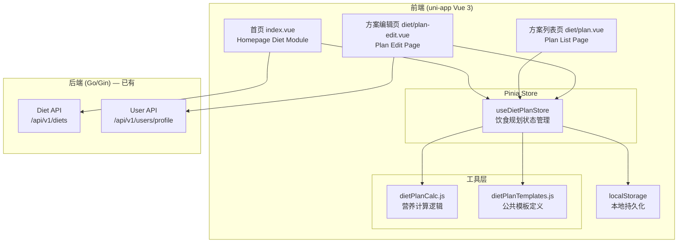
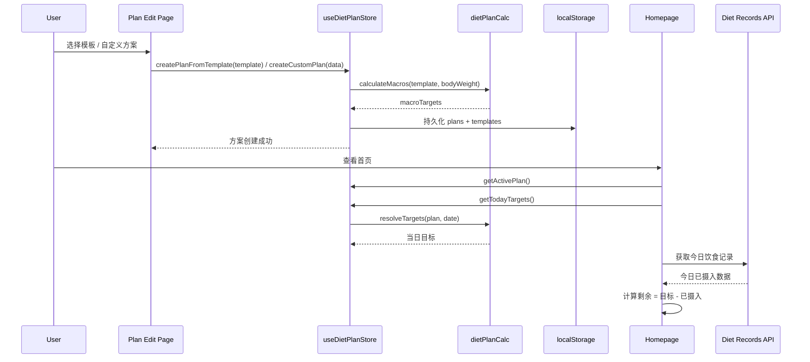

# Design Document: Diet Plan (饮食规划)

## Overview

本设计文档描述 Vital Fitness 应用的「饮食规划」功能的技术实现方案。该功能允许用户通过选择预设模板或自定义方案来设定每日营养目标（热量、蛋白质、碳水化合物、脂肪），并在首页展示当日饮食目标完成进度。

初期实现采用纯前端方案，数据通过 localStorage 持久化，后续迭代再接入后端 API。系统支持三种方案类型：固定比例（fixed）、碳循环（carb_cycle）和碳水渐降（carb_taper）。

### 设计目标

- 与现有饮食记录功能无缝集成，复用已有的 API 和数据结构
- 遵循项目现有的 Pinia store + uni-app 页面模式
- 首页饮食模块嵌入现有 index.vue，不破坏现有布局
- 数据模型设计兼顾 localStorage 初期方案和未来后端 API 迁移

## Architecture

### 系统架构



### 数据流



## Components and Interfaces

### 1. Pinia Store: `useDietPlanStore`

**文件**: `vital-fitness/frontend/src/store/dietPlan.js`

遵循现有 `useUserStore` 的 Options API 风格。

```javascript
// store/dietPlan.js
export const useDietPlanStore = defineStore('dietPlan', {
  state: () => ({
    plans: [],              // UserDietPlan[]
    privateTemplates: [],   // DietPlanTemplate[] (scope='private')
    activePlanId: null      // string | null
  }),

  getters: {
    activePlan: (state) => state.plans.find(p => p.id === state.activePlanId) || null,
    allTemplates: (state) => [...PUBLIC_TEMPLATES, ...state.privateTemplates],
    publicTemplates: () => PUBLIC_TEMPLATES,
  },

  actions: {
    // 初始化：从 localStorage 恢复
    init(),
    
    // 方案 CRUD
    createPlanFromTemplate(templateId, overrides, bodyWeight),
    createCustomPlan(planData),
    updatePlan(planId, updates),
    deletePlan(planId),
    
    // 激活/停用
    activatePlan(planId),
    deactivatePlan(planId),
    
    // 自定义模板 CRUD
    createPrivateTemplate(templateData),
    updatePrivateTemplate(templateId, updates),
    deletePrivateTemplate(templateId),
    
    // 持久化
    _persist(),
    _restore(),
  }
})
```

### 2. 计算工具: `dietPlanCalc.js`

**文件**: `vital-fitness/frontend/src/utils/dietPlanCalc.js`

纯函数模块，负责所有营养目标计算逻辑。

```javascript
// 根据模板和体重计算宏量营养素
export function calculateMacrosFromTemplate(template, bodyWeight)
  // 返回 { calories, protein, carbs, fat }

// 获取碳循环方案当日目标
export function getCarbCycleDayTargets(plan, date)
  // 根据 date 的星期几查 cycleConfig，返回对应的 macroTargets

// 获取碳水渐降方案当日目标
export function getCarbTaperDayTargets(plan, date)
  // 根据 startedAt 计算当前周数，递减碳水，返回 macroTargets

// 统一获取方案当日目标
export function getTodayTargets(plan, date = new Date())
  // 根据 plan.type 分发到对应计算函数

// 计算剩余热量
export function calculateRemaining(targets, consumed)
  // 返回 { calories, protein, carbs, fat } 各项剩余值
```

### 3. 公共模板定义: `dietPlanTemplates.js`

**文件**: `vital-fitness/frontend/src/utils/dietPlanTemplates.js`

硬编码的 5 个公共模板，每个模板包含名称、描述、类型和基于体重的计算参数。

```javascript
export const PUBLIC_TEMPLATES = [
  {
    id: 'tpl_balanced',
    scope: 'public',
    name: '均衡饮食',
    description: '40%碳水 / 30%蛋白 / 30%脂肪，适合日常健康饮食',
    type: 'fixed',
    calcConfig: { caloriesPerKg: 30, proteinRatio: 0.30, carbsRatio: 0.40, fatRatio: 0.30 }
  },
  {
    id: 'tpl_carb_cycle',
    scope: 'public',
    name: '碳循环',
    description: '训练日高碳、休息日低碳，适合增肌减脂交替',
    type: 'carb_cycle',
    calcConfig: {
      high: { caloriesPerKg: 33, proteinPerKg: 2.0, carbsPerKg: 4.0, fatPerKg: 0.8 },
      low:  { caloriesPerKg: 26, proteinPerKg: 2.2, carbsPerKg: 1.5, fatPerKg: 1.0 }
    },
    defaultCycleConfig: { 0: 'low', 1: 'high', 2: 'low', 3: 'high', 4: 'low', 5: 'high', 6: 'low' }
  },
  {
    id: 'tpl_carb_taper',
    scope: 'public',
    name: '碳水渐降',
    description: '每周递减碳水摄入，适合备赛或短期减脂',
    type: 'carb_taper',
    calcConfig: { caloriesPerKg: 28, proteinPerKg: 2.0, initialCarbsPerKg: 3.0, fatPerKg: 0.9 },
    defaultTaperConfig: { totalWeeks: 8, weeklyReduction: 15 }
  },
  {
    id: 'tpl_high_protein',
    scope: 'public',
    name: '高蛋白增肌',
    description: '蛋白质2.0g/kg体重，适合增肌期',
    type: 'fixed',
    calcConfig: { caloriesPerKg: 35, proteinPerKg: 2.0, carbsRatio: 0.45, fatRatio: null }
  },
  {
    id: 'tpl_low_carb',
    scope: 'public',
    name: '低碳减脂',
    description: '低碳水高蛋白，适合减脂期',
    type: 'fixed',
    calcConfig: { caloriesPerKg: 24, proteinPerKg: 2.0, carbsRatio: 0.20, fatRatio: null }
  }
]
```

### 4. 页面组件

#### Plan List Page (`diet/plan.vue`)

- 展示当前激活方案（高亮）
- 列出所有用户方案（编辑/删除/激活操作）
- 列出所有模板（公共 + 私有），支持从模板创建方案
- 支持创建自定义方案入口
- 私有模板的编辑/删除操作

#### Plan Edit Page (`diet/plan-edit.vue`)

- 模式：新建（从模板）/ 新建（自定义）/ 编辑已有方案
- 通过 URL 参数区分：`?mode=template&templateId=xxx` / `?mode=custom` / `?mode=edit&planId=xxx`
- 根据方案类型动态展示不同配置区域：
  - fixed: 基础宏量营养素输入
  - carb_cycle: 周历选择 + 高碳/低碳日目标
  - carb_taper: 总周数 + 每周递减量 + 初始目标

#### Homepage Diet Module (嵌入 `index/index.vue`)

- 条件渲染：有激活方案时显示进度，无方案时显示引导
- 显示剩余热量、已摄入热量、宏量营养素进度条
- 快捷记录按钮（早餐/午餐/晚餐/加餐）
- 方案设置入口链接

## Data Models

### DietPlanTemplate（饮食方案模板）

```typescript
interface DietPlanTemplate {
  id: string                    // 唯一标识，公共模板用 'tpl_xxx'，私有模板用 UUID
  userId: string | null         // 公共模板为 null，私有模板为用户 ID
  scope: 'public' | 'private'   // 模板范围
  name: string                  // 模板名称
  description: string           // 模板描述
  type: 'fixed' | 'carb_cycle' | 'carb_taper'  // 方案类型
  
  // 计算配置（用于根据体重自动计算）
  calcConfig: {
    // fixed 类型
    caloriesPerKg?: number       // 每公斤体重热量
    proteinPerKg?: number        // 每公斤体重蛋白质（克）
    proteinRatio?: number        // 蛋白质占总热量比例（0-1）
    carbsRatio?: number          // 碳水占总热量比例（0-1）
    fatRatio?: number            // 脂肪占总热量比例（0-1）
    
    // carb_cycle 类型
    high?: { caloriesPerKg, proteinPerKg, carbsPerKg, fatPerKg }
    low?: { caloriesPerKg, proteinPerKg, carbsPerKg, fatPerKg }
  }
  
  // 碳循环默认周配置
  defaultCycleConfig?: Record<number, 'high' | 'low'>  // 0=周日..6=周六
  
  // 碳水渐降默认配置
  defaultTaperConfig?: {
    totalWeeks: number
    weeklyReduction: number      // 每周碳水递减量（克）
  }
}
```

### UserDietPlan（用户饮食方案）

```typescript
interface UserDietPlan {
  id: string                    // UUID
  userId: string                // 用户 ID
  templateId: string | null     // 来源模板 ID（自定义方案为 null）
  isActive: boolean             // 是否激活
  name: string                  // 方案名称
  type: 'fixed' | 'carb_cycle' | 'carb_taper'  // 方案类型
  startedAt: string             // ISO 日期字符串，方案开始日期
  createdAt: string             // ISO 日期字符串
  
  // 宏量营养素目标（fixed 类型直接使用，carb_cycle/carb_taper 作为基础值）
  macroTargets: {
    calories: number             // 每日热量目标（千卡）
    protein: number              // 蛋白质目标（克）
    carbs: number                // 碳水目标（克）
    fat: number                  // 脂肪目标（克）
  }
  
  // 碳循环配置（仅 carb_cycle 类型）
  cycleConfig?: {
    dayMap: Record<number, 'high' | 'low'>  // 0=周日..6=周六
    highDayTargets: { calories, protein, carbs, fat }
    lowDayTargets: { calories, protein, carbs, fat }
  }
  
  // 碳水渐降配置（仅 carb_taper 类型）
  taperConfig?: {
    totalWeeks: number
    weeklyReduction: number      // 每周碳水递减量（克）
    initialCarbs: number         // 初始碳水目标（克）
    minCarbs: number             // 最低碳水阈值（默认 50g）
  }
}
```

### MacroTargets（宏量营养素目标）

```typescript
interface MacroTargets {
  calories: number   // 千卡
  protein: number    // 克
  carbs: number      // 克
  fat: number        // 克
}
```

### localStorage 存储结构

```javascript
// Key: 'diet_plans'
// Value: JSON string of UserDietPlan[]

// Key: 'private_templates'  
// Value: JSON string of DietPlanTemplate[] (scope='private' only)

// Key: 'active_plan_id'
// Value: string (plan id) or null
```


## Correctness Properties

*A property is a characteristic or behavior that should hold true across all valid executions of a system — essentially, a formal statement about what the system should do. Properties serve as the bridge between human-readable specifications and machine-verifiable correctness guarantees.*

### Property 1: Template aggregation returns all templates

*For any* set of private templates belonging to the current user, the `allTemplates` getter SHALL return a list containing all 5 public templates plus all of the user's private templates, with no duplicates and no missing entries.

**Validates: Requirements 1.1**

### Property 2: Private template creation sets correct metadata

*For any* valid template data provided to `createPrivateTemplate`, the resulting stored template SHALL have `scope` set to `'private'` and `userId` set to the current user's ID.

**Validates: Requirements 1.4**

### Property 3: Public templates are immutable

*For any* template with `scope='public'`, attempts to update or delete the template through the store SHALL be rejected, leaving the public templates array unchanged.

**Validates: Requirements 1.7**

### Property 4: Macro calculation from fixed template

*For any* valid body weight (positive number) and any fixed-type template with ratio-based `calcConfig`, `calculateMacrosFromTemplate` SHALL produce macro targets where:
- `calories` equals `bodyWeight * caloriesPerKg`
- protein, carbs, and fat gram values are derived from the template's per-kg or ratio parameters
- all output values are non-negative numbers

**Validates: Requirements 2.1, 2.2, 2.3, 2.4**

### Property 5: Template-to-plan snapshot isolation

*For any* template and body weight, when a `UserDietPlan` is created from the template, subsequent modifications to the source template SHALL NOT alter the plan's `macroTargets`, `cycleConfig`, or `taperConfig`.

**Validates: Requirements 2.5, 2.6**

### Property 6: Plan numeric input validation

*For any* numeric input value, the plan validation logic SHALL:
- accept calorie targets that are positive numbers greater than zero
- reject calorie targets that are zero, negative, or non-numeric
- accept protein, carbohydrate, and fat targets that are non-negative numbers
- reject protein, carbohydrate, and fat targets that are negative
- accept taper `totalWeeks` only when it is a positive integer
- accept taper `weeklyReduction` only when it is a positive number

**Validates: Requirements 3.2, 3.3, 6.5**

### Property 7: Custom plan creation produces fixed-type plan

*For any* valid custom plan data (name, calories > 0, non-negative macros), `createCustomPlan` SHALL produce a `UserDietPlan` with `type` set to `'fixed'` and `macroTargets` exactly matching the provided values.

**Validates: Requirements 3.4**

### Property 8: Single active plan invariant

*For any* sequence of `activatePlan` and `deactivatePlan` operations on any number of plans, at most one `UserDietPlan` SHALL have `isActive === true` at any point in time.

**Validates: Requirements 4.1, 4.2**

### Property 9: Carb cycle day-of-week target lookup

*For any* valid `Carb_Cycle_Plan` with a `cycleConfig.dayMap` and any date, `getCarbCycleDayTargets(plan, date)` SHALL return `highDayTargets` if the date's weekday maps to `'high'` in `dayMap`, or `lowDayTargets` if it maps to `'low'`.

**Validates: Requirements 5.3, 7.6**

### Property 10: Cycle config requires mixed day types

*For any* `cycleConfig.dayMap` where all 7 days are set to the same type (all `'high'` or all `'low'`), validation SHALL reject the configuration. *For any* `dayMap` with at least one `'high'` and at least one `'low'`, validation SHALL accept the configuration.

**Validates: Requirements 5.5**

### Property 11: Carb taper weekly target calculation

*For any* valid `Carb_Taper_Plan` with `taperConfig` (initialCarbs, weeklyReduction, totalWeeks, minCarbs=50) and any date, `getCarbTaperDayTargets(plan, date)` SHALL calculate the carbohydrate target as `max(initialCarbs - (weekNumber - 1) * weeklyReduction, 50)`, where `weekNumber = floor((date - startedAt) / 7 days) + 1`.

**Validates: Requirements 6.2, 6.3, 6.4, 7.7**

### Property 12: Remaining calories calculation

*For any* macro targets and consumed values (both non-negative), `calculateRemaining(targets, consumed)` SHALL return values where each macro's remaining equals `target - consumed` for that macro.

**Validates: Requirements 7.1**

### Property 13: localStorage persistence round-trip

*For any* set of `UserDietPlan` entries and `DietPlanTemplate` entries (private), persisting them to localStorage via `_persist()` and then restoring via `_restore()` SHALL produce data that is deeply equal to the original data.

**Validates: Requirements 8.1, 8.2, 8.3**

### Property 14: In-place plan update preserves identity

*For any* existing `UserDietPlan` and valid update data, `updatePlan(planId, updates)` SHALL modify the plan's fields to match the updates while preserving the plan's `id`, `userId`, and `createdAt` values.

**Validates: Requirements 9.1**

### Property 15: Deleting active plan clears active state

*For any* set of plans where one plan is active, deleting the active plan SHALL result in `activePlan` being `null` and `activePlanId` being `null`.

**Validates: Requirements 9.3**

## Error Handling

### 前端错误处理

| 场景 | 处理方式 |
|------|----------|
| 体重未设置时选择需要体重计算的模板 | 弹出提示，引导用户先设置体重（跳转到 profile 页面或弹窗输入） |
| localStorage 读取失败或数据损坏 | 捕获 JSON.parse 异常，重置为空数组，显示 toast 提示 |
| localStorage 写入失败（存储空间不足） | 捕获异常，显示 toast 提示用户清理存储 |
| 方案验证失败（无效输入） | 在对应输入字段下方显示红色错误提示文字，阻止提交 |
| 碳水渐降计算结果低于 50g | 自动 cap 到 50g，在 UI 上显示提示说明已达最低阈值 |
| 删除操作 | 统一使用 `uni.showModal` 二次确认，防止误操作 |
| 获取今日饮食记录 API 失败 | 首页模块显示 "数据加载失败"，不影响方案展示 |
| 激活方案时发现数据不一致 | 强制清理其他 active 状态，确保单一激活不变量 |

### 数据迁移策略

当后续版本引入后端 API 时：
1. 检测 localStorage 中是否存在旧数据
2. 如果存在，批量上传到后端
3. 上传成功后清除 localStorage 数据
4. 后续读写切换到 API

## Testing Strategy

### 属性测试 (Property-Based Testing)

本功能的核心计算逻辑（营养素计算、碳循环查找、碳水渐降计算、验证逻辑、持久化）适合属性测试。计算函数是纯函数，输入空间大（体重、日期、配置参数组合），属性测试能有效发现边界情况。

**PBT 库**: 使用 [fast-check](https://github.com/dubzzz/fast-check) 作为属性测试库（JavaScript 生态最成熟的 PBT 库，与项目的 JS 技术栈匹配）。

**配置要求**:
- 每个属性测试最少运行 100 次迭代
- 每个测试用注释标注对应的设计文档属性编号
- 标注格式: `Feature: diet-plan, Property {number}: {property_text}`

**测试文件**: `vital-fitness/frontend/src/utils/__tests__/dietPlanCalc.test.js`

### 单元测试 (Example-Based)

针对具体场景和边界条件：
- 5 个公共模板的具体计算结果验证（2.2, 2.3, 2.4）
- 体重为 0 或 null 时的错误处理（2.7）
- cycleConfig 数据结构格式验证（5.4）
- 数据模型字段完整性检查（8.4, 8.5）
- 删除方案后列表更新（9.2）
- 特定验证错误消息（3.5）

**测试文件**: `vital-fitness/frontend/src/utils/__tests__/dietPlanCalc.unit.test.js`

### Pinia Store 测试

- Store 初始化和 localStorage 恢复
- CRUD 操作的状态变更
- Getter 计算结果

**测试文件**: `vital-fitness/frontend/src/store/__tests__/dietPlan.test.js`

### 手动测试

以下场景需要手动测试：
- 页面导航流程（10.1-10.4）
- UI 样式和视觉区分（1.3, 4.4, 7.8）
- 首页模块在不同方案类型下的展示效果
- 微信小程序真机兼容性
